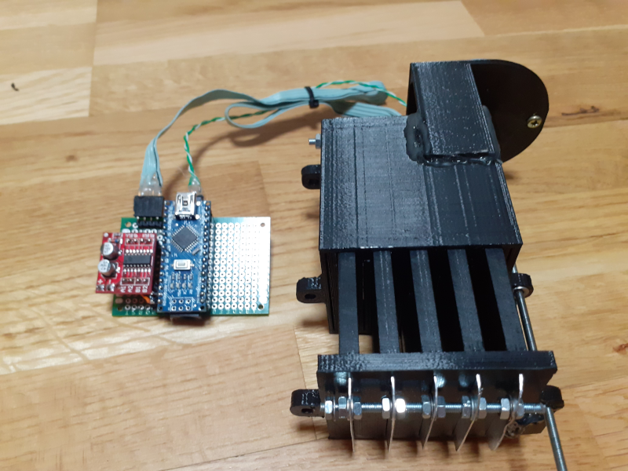

# Magnetic loop antenna capacitor controller
Magnetic loop antenna capacitor controller based on Arduino Nano, L298N stepper driver, EM-290 stepper from Epson printer and 3d printed slide capacitor.

# Serial commands

