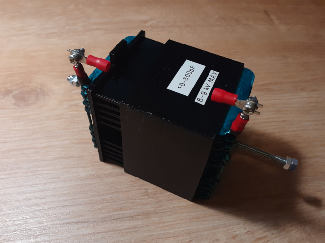

# Magnetic loop antenna capacitor controller
Magnetic loop antenna capacitor controller based on 
 - OpenSCAD project to generate custom sliding variable high voltage capacitors
 - Arduino Nano
 - L298N stepper driver
 - EM-290 stepper from Epson printer
 - HC-06 bluetooth serial controller for remote control using Bluetooth console application from the phone or PC
 - Generated high voltage 3d printed slide capacitor printed with PETG plastic (up to ~15kV and 130pF)
   - Plate sizes are ~70x55 mm
   - Capacitor dimensions are 60x70x80 mm
   - Plate spacing 5 mm
   - 14 plates
   - Worm gear is M4
   - Can handle 100W CW without arcing (tested with 0.9m loop) and continous 50W operation in FT8
   - Capacitance range ~5-130 pF
   - Can tune ~9-29 MHz with 0.9m loop
 - Second test generated medium voltage 3d printed slide capacitor up to ~6 kV and higher 400pF capacitance

# Serial commands
On successful command execution "ok" is returned when operation was successfully completed or "err" if command was unsuccessful. Next commands are supported:
 - *p*: park to initial 0 position, automatically performed when powered on
 - *c*: start calibration procedure, each time capacitor goes into new position you need to type frequency where resonance occurs, calibration is done across 10 points and then linear interpolation is used to find position based on input frequency, calibration points are stored in EEPROM after completion and loaded when powered on
 - *u*: go/tune up to higher frequency
 - *d*: go/tune down to lower frequency
 - *number*, frequency in kHz where to move capacitor, should be used after calibration procedure completion

# Configuration parameters (capctrl.h)
 - *ConfigSpeed*: stepper speed, default is 64
 - *ConfigStep*: number of steps for tune up/down commands, default is 20
 - *ConfigMaxPos*: end position of capacitor, maximum number of steps, default is 5200
 - *ConfigCalPoints*: number of calibration points, default is 10
 - *ConfigCalAddr*: EEPROM start address where calibration data is stored, default is 0x0

# Photos
- Large capacitor

-  Medium size capacitor with larger capacitance

- Test magnetic loop antenna, ~1m diameter, ~40mm tube width

